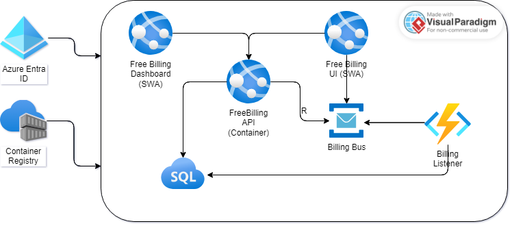

# FreeBilling

This is an example project of a project time-billing system. The purpose of the example is to show a sane project structure and a real-world, but small example of a complete system.

The system diagram looks like:

The system will use:

- ASP.NET 8/9
- Azure Container Registry
- Vue 3.x
- Azure Service Bus
- Azure Function App
- Azure SQL
- Azure Entra ID
- Azure Service App (Static Web App)
- Azure Serivce App (Container)

As the project continues, we'll be adding more documentation.
